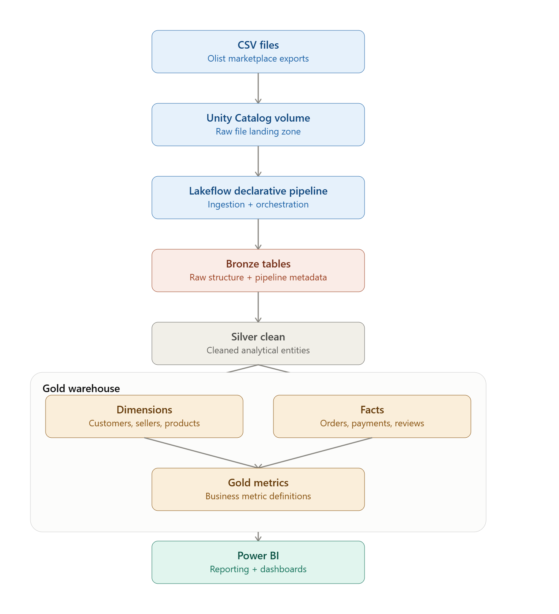

# Marketplace_Intelligent_Plarform
A reliable data intelligent platform for a Marketplace company that supports data driven decision making.


### Why do we need a data platform for a marketplace?
```
Customer churns
    -> fewer orders placed
        -> seller GMV on Olist drops
            -> seller sees poor ROI on their Olist subscription
                -> seller churns
                    -> fewer products on platform
                        -> remaining customers have less selection
                            -> more customers churn

NOTE: 
This is a demand-supply death spiral.
It's the existential risk for any two-sided marketplace.
One side leaving accelerates the other side leaving.
```
A **data platform gives a Marketplace enough lead time to intervene before the spiral starts**. By the time churn is visible in revenue, you're already 2-3 months into the problem. An analytics platform surfaces it earlier.

# Business problem: 
This project simulates the data platform of an e-commerce marketplace. The marketplace has orders, customers, sellers, products, payments and reviews operational datasets. 
- **The business wants to understand four things:**
    - how the marketplace is performing?
    - Is the revenue per transaction growing, flat, or degrading over time?
    - whether delivery performance is damaging the customer experience?
    - which sellers may be contributing to poor delivery outcomes?

- The challenge isn't simply storing the CSV files. The challenge is turning multiple operational datasets into a reliable analytical model that business users can use to measure marketplace performance.


# Business questions:
- How much revenue and order volume does the marketplace generate? 
- What is the average order value? 
- Which sellers are inactive, at risk, or potentially churned? 
- Which sellers appear to contribute to poor delivery performance?
- What percentage of orders arrive on time? 
- How much time do sellers take to hand orders to carriers? 
- How much time is spent in carrier transit?


# *Architecture*


# Future enhancements:
### Ingestion reliability:
- Incremental ingestion
- Retry/idempotency handling
- Data quality expectations
- Quarantine and reconciliation

### Schema reliability:
- Schema evolution
- Schema breakage detection
- Contract validation

### Analytical depth:
- Customer cohort retention
- Seller cohort analysis
- Root-cause analysis
Current scope and limitations:

# Current version:
- Static source data
- Full-load pipeline
- No CDC
- No SCD Type 2
- No production source-system integration
- Synthetic incremental/retry scenarios not yet implemented
- Descriptive rather than causal analytics
